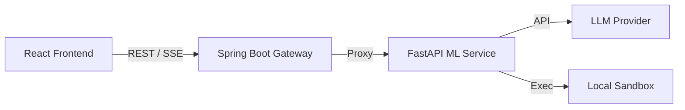

# 🕵️ STRATEGOS — Autonomous Data Analyst Agent

**STRATEGOS** is a full-stack, AI-powered autonomous data analyst. Upload any CSV or Excel dataset, ask questions in plain English, and the agent will independently reason, write Python code, execute it in a secure sandbox, and generate comprehensive reports with interactive visualizations.

Built with a **React** frontend, a **Spring Boot** API Gateway, and a **FastAPI** Python ML Service powering a custom ReAct (Reason + Act) loop.

---

## 🌟 Key Features

- **🧠 Autonomous Agent Loop:** Custom ReAct loop implementation. The agent plans its approach, writes Pandas/Matplotlib code, executes it, self-corrects if errors occur, and repeats until the analysis is complete.
- **⚡ Live Streaming:** Server-Sent Events (SSE) stream the agent's internal "thought process" and code execution directly to the UI in real-time.
- **📊 Auto-Visualizations:** The agent is instructed to generate `matplotlib` charts, which are base64-encoded and embedded directly in the final report.
- **🔌 Multi-Model Support:** Seamlessly switch between **Gemini**, **Claude**, and **GPT-4** from the UI.
- **🏢 Enterprise SaaS UI:** Clean, professional dashboard design.
- **🔒 Secure Architecture:** 3-tier architecture with a Java Spring Boot gateway handling routing, file validation, and CORS, isolating the Python ML execution environment.

## 🏗️ Architecture



## 🚀 Quick Start (Docker)

The easiest way to run STRATEGOS is via Docker Compose.

1. Clone the repository
2. Create a `.env` file in the root directory (or use `.env.example`)
3. Run:
```bash
docker compose up --build -d
```
4. Access the UI at `http://localhost:3000`

## 🛠️ Tech Stack

- **Frontend:** React, TailwindCSS, Lucide Icons, Vite
- **Gateway:** Java 17, Spring Boot 3.2, Spring WebFlux
- **ML Service:** Python 3.11, FastAPI, Pandas, Matplotlib, LangChain / LiteLLM
- **Deployment:** Docker, Docker Compose

## 📝 Usage

1. **Upload Data:** Drag and drop a `.csv` or `.xlsx` file.
2. **Profile Data:** Review the automatically generated Data Explorer profile to see column types, null counts, and sample values.
3. **Ask a Question:** Ask a specific question (e.g., "What factors drive employee attrition?") or ask for a general analysis.
4. **Watch the Agent:** Observe the right sidebar to see the agent's live reasoning, tool usage, and execution logs.
5. **Review Report:** Analyze the generated Executive Summary, Key Findings, Recommendations, and Charts.
6. **Follow-up:** Use the Follow-up Chat to ask specific questions about the generated report.
